# Algoritmos de Escalonamento

## Especificação do Algoritmo planejado - Lab 02

O **algoritmo de escalonamento** de processos será implementado seguindo o modelo de loteria com prioridade.

Existirão **quatro classes de prioridade** no sistema com valores que variam de 0 a 3, sendo a **prioridade 3** como a **mais relevante** e a **prioridade 0** como a **menos relevante**.

Os processos a serem executados serão enfileirados em uma lista, que é **ordenada segundo seu PID**, representando a ordem de chegada no sistema.

O **escalonador irá selecionar a prioridade** do próximo processo a ser executado a partir de um **sorteio** de um valor que pode **variar entre 0 e 100**, onde os valores menores que 10 representam a prioridade 0, os menores que 25 e maiores que 10 representam a prioridade 1, os maiores que 25 e menores que 50 representam a prioridade 2, e os maiores que 50 representam a prioridade 3.

Desta forma, a seleção do próximo processo a ser realizado segue o seguinte padrão: *sorteio de um valor -> seleção da prioridade correspondente -> validação de existência de pelo menos um processo com a prioridade selecionada -> a partir do último processo executado, selecionar o próximo processo na lista que tenha a prioridade selecionada*.

Assim, o algoritmo visa **garantir uma preferência na alocação** de processos com maior prioridade na CPU, reduzindo o risco Inanição (*Starvation*), ao **custo de um aumento do processamento** na hora de selecionar a prioridade do processo a ser alocado.

Portanto, em um **processamento médio de várias interações** é esperado que a distribuição de acesso a CPU dos processos de cada prioridade se aproximem da seguinte divisão: 

- Prioridade 0: 10%
- Prioridade 1: 15%
- Prioridade 2: 25%
- Prioridade 3: 50%

## Análise do Desempenho na simulação - Lab3

As simulações foram realizadas considerando quatro políticas de escalonamento de processos:

- **Round Robin**: que distribui igualmente o tempo de CPU entre os processos ativos;
- **Priority Random**: que realiza um sorteio da prioridade a ser atendida, conforme descrito no tópico anterior;
- **Xv6 Priority Random**: que faz o mesmo que o anterior, porém realiza um novo sorteio a cada vez que não é encontrada um processo com a prioridade sorteada na lista, em uma varredura parcial.
- **Priority Updating**: que decrementa o valor da prioridade de todos os processos a cada escalonamento, e ao retirar um processo da CPU atualiza o valor da sua prioridade para o valor originalmente definido. 

Importante mencionar que para possibilitar uma análise comparativa uma alteração foi realizada nos algoritmos de sorteio onde se realizou a inversão do peso das prioridades, assim a prioridade 0 passou a ser a mais relevante e a prioridade 3 a menos relevante, mantendo-se a distribuição estatística do sorteio.

Para realizar a simulação foram geradas três cargas de trabalho, onde o número de processos por prioridade é sempre igual e múliplo de 4 e que podem assumir quatro valores(5, 10, 15, 20). O tempo de execução e o tempo de submissão seriam iguais para todos os processos, com valores de 100 e 1 unidades de tempo, respectivamente. Por fim, foram utilizados 4 cargas de trabalho distintas com número de 40, 400 e 4000.

Podemos verificar a igualdade da duração a partir dos boxplots abaixo:

40 Processos              |  400 Processos             | 4000 Processos
:-------------------------:|:-------------------------:|:-------------------------:
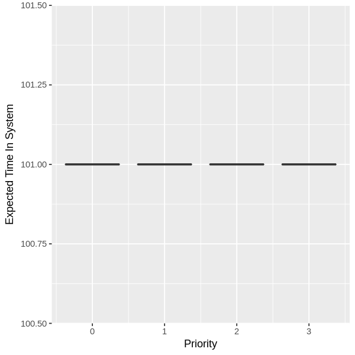 |  | 

Assim, para os algoritmos baseados em sorteio, que trabalho com 4 classes de prioridade, foi realizada uma relação de equivalência mantendo a ordem numérica.

A partir da carga de trabalho, o objetivo é avaliar o desempenho dos algoritmos conforme os parêmetros dados no livro de sistemas operacionais do tanebaum, que seriam:

- **Aplicação da política**: Verificar se a política proposta foi devidamente cumprida;
- **Justiça**: Verificar se os processos foram tratados de forma igual, considerando seu nível de igualdade;

### Aplicação da política

A verificação da aplicação da política foi realizada através da observação do *tempo extra de execução* que representa a diferente entre o tempo de duração e o tempo de execução do processo.

Desta forma, os processos com maior prioridade devem ter menores valores dado que todos os processo tem a mesma duração esperada.

O tamanho da caixa do boxplot implica o grau de variação dos valores de tempo de execução adicional ao tempo definido na submissão, sendo possível inclusive avaliar a média dos valores assim verificando se a política foi aplicada.

O plot separa as caixas de acordo com as quatro classes de prioridade existentes, vejamos:

##### Carga de Trabalho com 40 processos

Round Robin             |  Priority Updating | Priority Random             |  Xv6 Priority Random
:-------------------------:|:-------------------------:|:-------------------------:|:-------------------------:
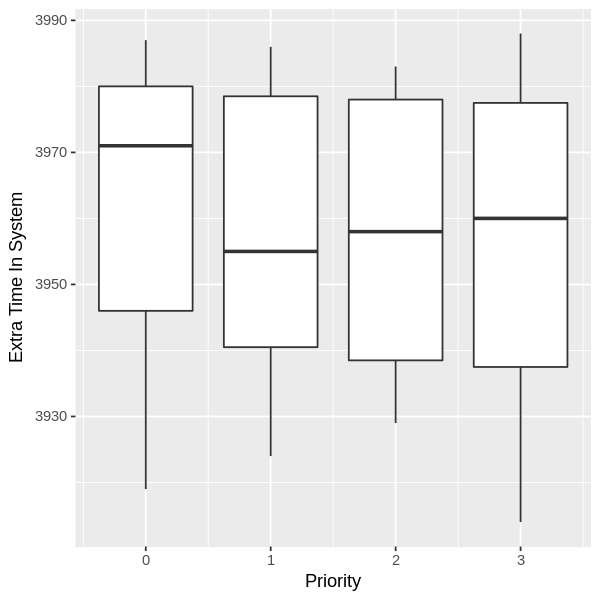 | 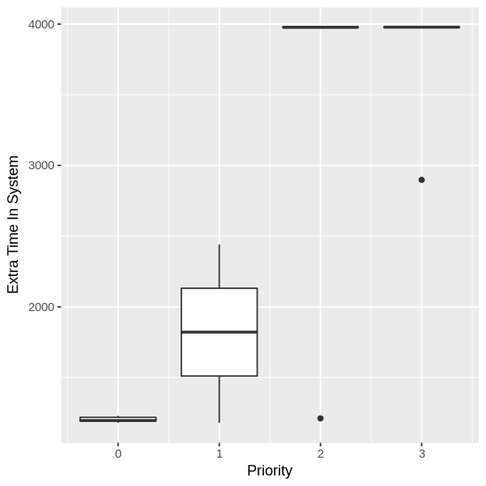 | 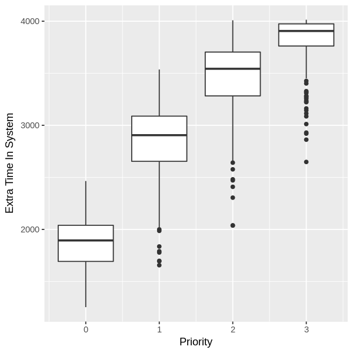 | 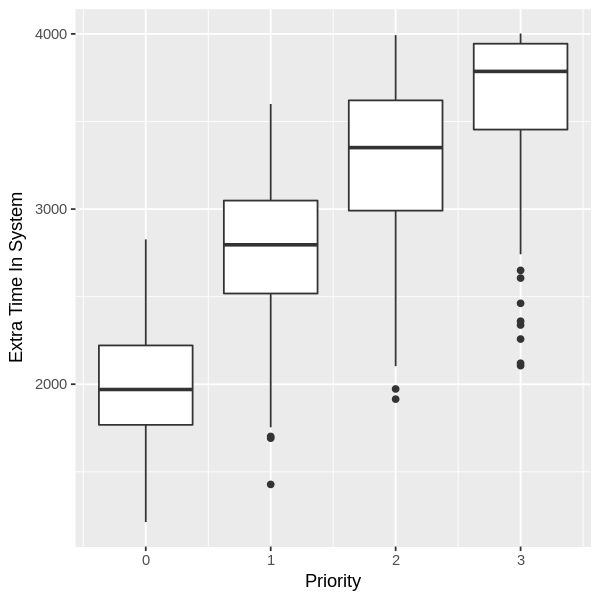

##### Carga de Trabalho com 400 processos

Round Robin             |  Priority Updating | Priority Random             |  Xv6 Priority Random
:-------------------------:|:-------------------------:|:-------------------------:|:-------------------------:
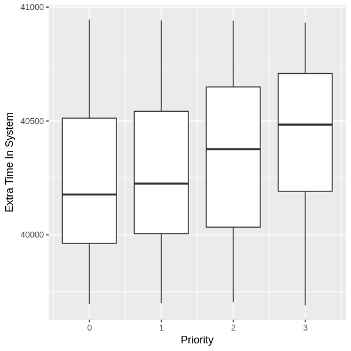 |  | 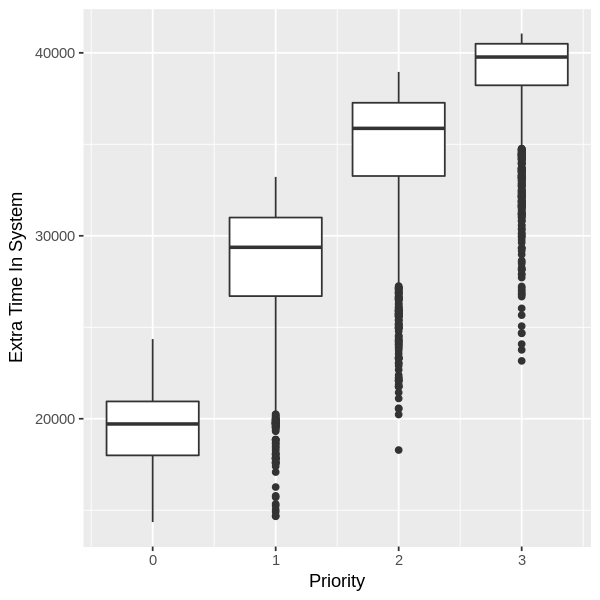 | 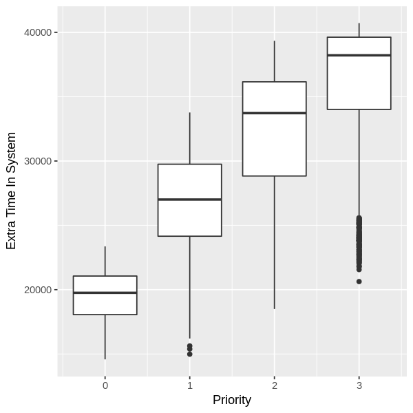

##### Carga de Trabalho com 4000 processos

Round Robin             |  Priority Updating | Priority Random             |  Xv6 Priority Random
:-------------------------:|:-------------------------:|:-------------------------:|:-------------------------:
 |  |  | 

Ao mesmo tempo, podemos observar ainda o impacto da carga sobre os algoritmos:

#### Round Robin
40 Processos              |  400 Processos             | 4000 Processos
:-------------------------:|:-------------------------:|:-------------------------:
 |  | 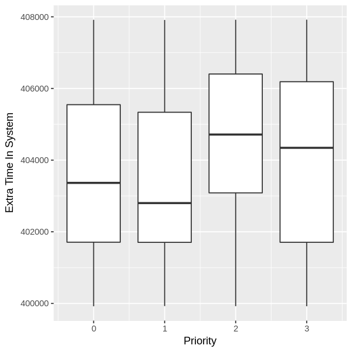

#### Priority Updating
40 Processos              |  400 Processos             | 4000 Processos
:-------------------------:|:-------------------------:|:-------------------------:
 |  | 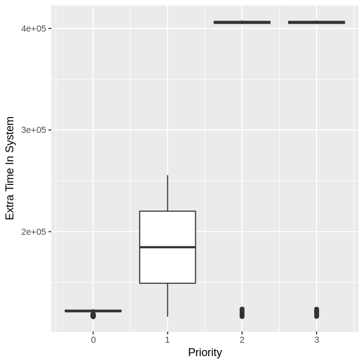

#### Priority Random
40 Processos              |  400 Processos             | 4000 Processos
:-------------------------:|:-------------------------:|:-------------------------:
 |  | 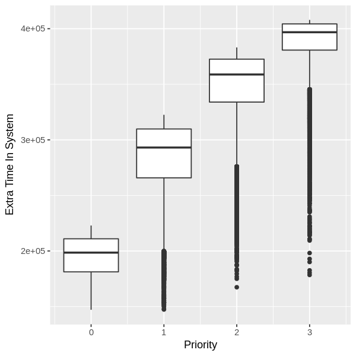

#### Xv6 Priority Random
40 Processos              |  400 Processos             | 4000 Processos
:-------------------------:|:-------------------------:|:-------------------------:
 |  | 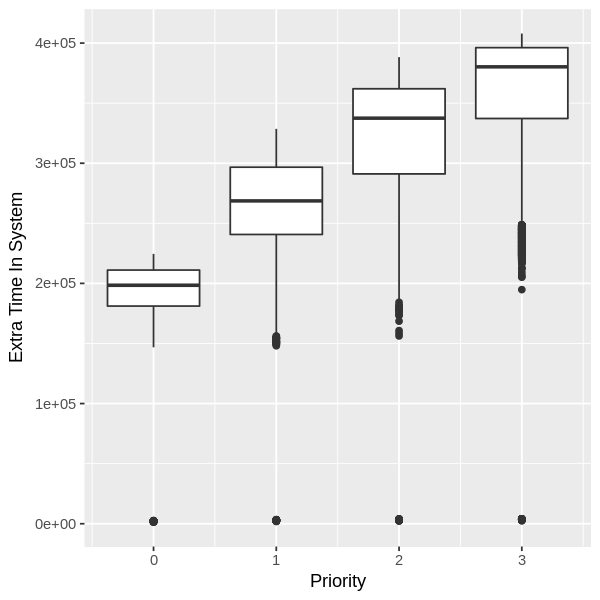

A partir dos gráficos, podemos avaliar que das quatro políticas analisadas cumpriram com seu requisito de justiça, bastando observar que no **Round Robin** as quatro caixas tem valores muito próximos e nos demais existe uma diferença de patamar conforme se varia a prioridade.

Tal diferença é decorrente do grau de variação da escolha do processo a ser executado: 

- **Round Robin**: que tem um comportamento sempre constante, tem menor grau de variância;
- **Priority Updating**: realiza modificações no valor das prioridades ao longo da execução, o que geral algum grau de varialibilidade;
- **Priority Random** e **Xv6 Priority Random**: tem um alto nível de modificação, mas o *primeiro* é mais eficaz em razão da característica do *segundo* de realizar mais de um sorteio no mesmo escalonamento sem verificar todos os processos contidos na lista.

### Justiça

O grau de justiça dos algoritmos foi avaliado considerando o *tempo de resposta* que representa a demora de tempo que o processo teve para ocupar a CPU pela primeira vez. 

Utilizou-se de boxplot para observar o grau de variância dos valores correspondentes ao tempo de resposta dos processos, conforme os gráficos abaixo:

#### Carga de Trabalho com 40 processos

Round Robin             |  Priority Updating | Priority Random             |  Xv6 Priority Random
:-------------------------:|:-------------------------:|:-------------------------:|:-------------------------:
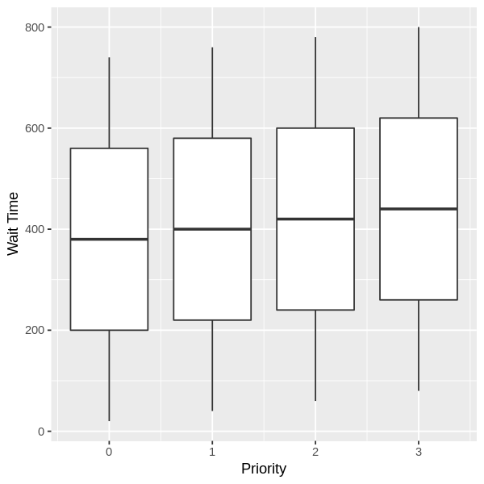 | 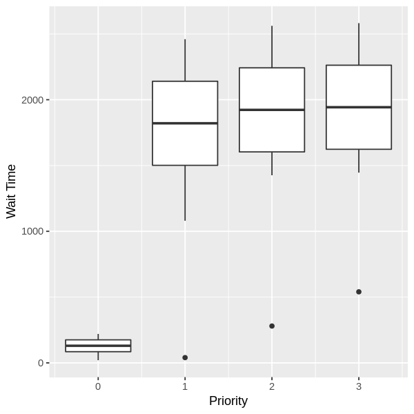 | 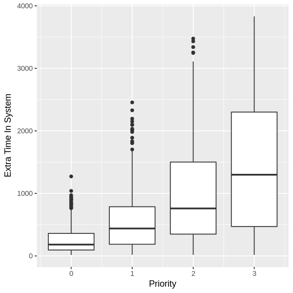 | 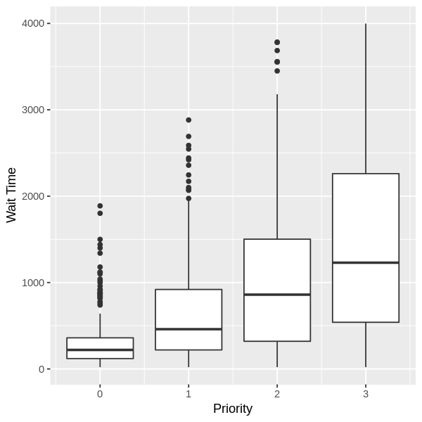

#### Carga de Trabalho com 400 processos

Round Robin             |  Priority Updating | Priority Random             |  Xv6 Priority Random
:-------------------------:|:-------------------------:|:-------------------------:|:-------------------------:
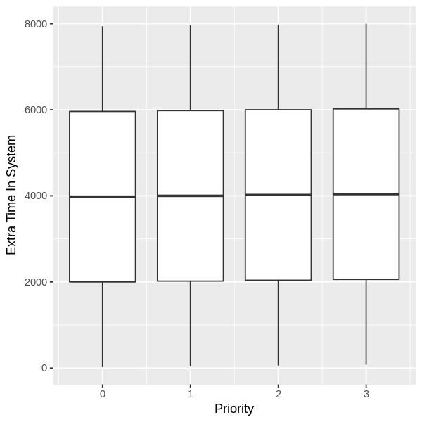 | 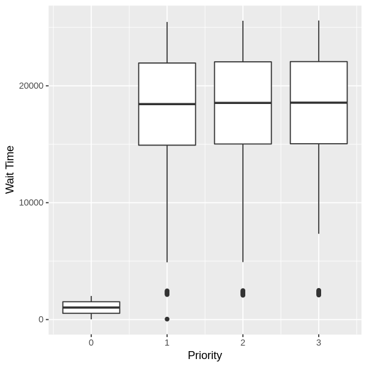 |  | 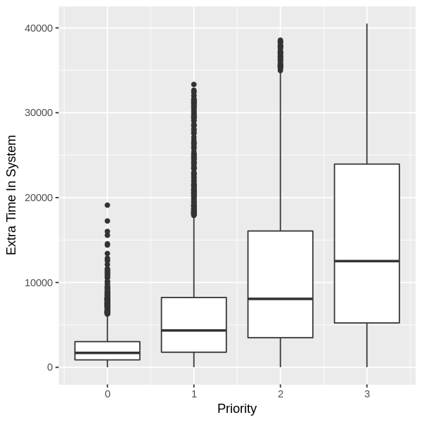

#### Carga de Trabalho com 4000 processos

Round Robin             |  Priority Updating | Priority Random             |  Xv6 Priority Random
:-------------------------:|:-------------------------:|:-------------------------:|:-------------------------:
 | 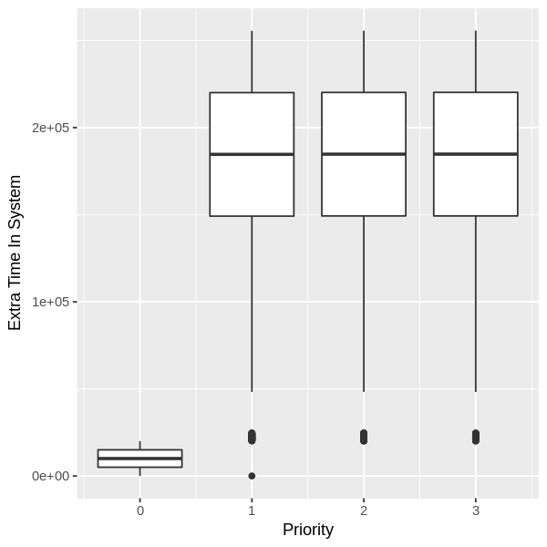 | 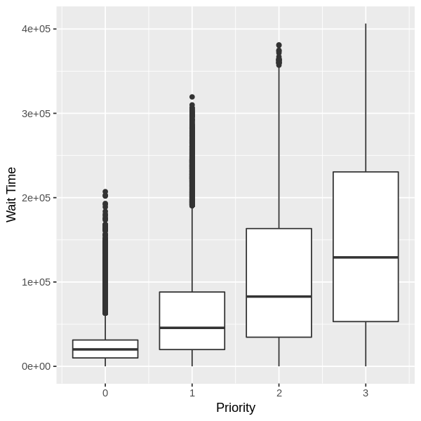 | 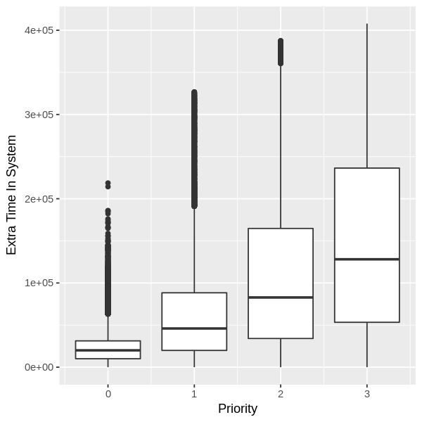

Podemos ainda visualizar os mesmos resultados considerando o impacto do aumento da carga nas políticas:

#### Round Robin
40 Processos              |  400 Processos             | 4000 Processos
:-------------------------:|:-------------------------:|:-------------------------:
 |  | 

#### Priority Updating
40 Processos              |  400 Processos             | 4000 Processos
:-------------------------:|:-------------------------:|:-------------------------:
 |  | 

#### Priority Random
40 Processos              |  400 Processos             | 4000 Processos
:-------------------------:|:-------------------------:|:-------------------------:
 |  | 

#### Xv6 Priority Random
40 Processos              |  400 Processos             | 4000 Processos
:-------------------------:|:-------------------------:|:-------------------------:
 |  | 

O primeiro compartamento interessante de se observar é que independente da quantidade de processos escalonados, o comportamento é o mesmo para todas as políticas, mesmo que os valores se modifiquem alterando a faixa.

Os resultados demonstram fatos interessantes sobre as políticas, o **Roud Robin** conforme esperado não faz distinção de prioridade, por consequência o tempo de resposta de todas os processos é igual.

A política **Priority Updating** sofreu uma alta variância nos valores, onde os processos com prioridade diferente de 0 tiveram um tempo de espera muito inferior as demais, prioridades que sempre apresentam um comportamento similar.

Por fim, as políticas que utilizam o sorteio para definir a prioridade apresentam uma melhor distribuição da CPU entre os processos, garantindo uma preferência aos processos com maior prioridade.

Assim, diante da grande diferença de valores entre as prioridades, podemos fazer uma análise da variação dos valores na prioridade 0, considerando as 4 políticas, através do boxplot abaixo:

40 Processos             |  400 Processos | 4000 Processos
:-------------------------:|:-------------------------:|:-------------------------:
 | 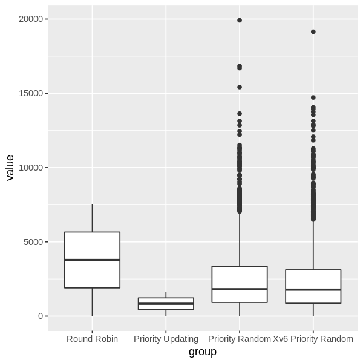 | 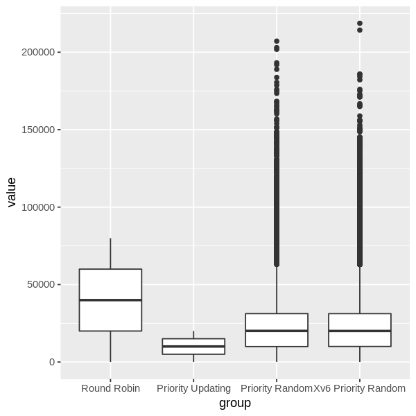 

Ante o gráfico, fica fácil perceber que o **Round Robin** não está sujeito a variação do valor de espera, enquanto as demais políticas tem um maior grau de justiça se você considerar que a variação de valores é sempre menor para a maioria.

Outro ponto importante de se observar é a existência de outliers nas políticas de prioridade, e isso ocorre em razão do sorteio que tem por consequência adicionar um grau de aleatoriedade ao escalonamento. 

Importante observar que as políticas de priorização tem tempo de espera sempre menor que o **Round Robin**, e dentre elas a **Priority Updating** tem tempo de espera sempre inferior que as demais.

## Conclusões

Diante dos resultados, podemos aduzir que as políticas de prioridade atingem com sucesso sua finalidade.

Contudo, cada abordagem de priorização tem suas peculiaridades que podem ser interessantes a depender do workload a ser submetido e da finalidade desejada. 

O tempo de resposta do algoritmo **Priority Updating** garante um menor valor nos processos de maior prioridade, e sacrifica muito os demais. 

Por outro lado, os demais algoritmos de prioridade, reduzem em menor proporção e com maior variância, mas o fazem para todas as prioridades, realizando uma priorização, mas sem sacrificar demais os processos com prioridade inferior.

Por fim, verificamos as duas políticas de prioridade por sorteio **Priority Random** e **Xv6 Priority Random** tem comportamento quase idêntico.