# Algoritmos de Escalonamento

## Especificação do Algoritmo planejado - Lab 02

O **algoritmo de escalonamento** de processos será implementado seguindo o modelo de loteria com prioridade.

Existirão **quatro classes de prioridade** no sistema com valores que variam de 0 a 3, sendo a **prioridade 3** como a **mais relevante** e a **prioridade 0** como a **menos relevante**.

Os processos a serem executados serão enfileirados em uma lista, que é **ordenada segundo seu PID**, representando a ordem de chegada no sistema.

O **escalonador irá selecionar a prioridade** do próximo processo a ser executado a partir de um **sorteio** de um valor que pode **variar entre 0 e 100**, onde os valores menores que 10 representam a prioridade 0, os menores que 25 e maiores que 10 representam a prioridade 1, os maiores que 25 e menores que 50 representam a prioridade 2, e os maiores que 50 representam a prioridade 3.

Desta forma, a seleção do próximo processo a ser realizado segue o seguinte padrão: *sorteio de um valor -> seleção da prioridade correspondente -> validação de existência de pelo menos um processo com a prioridade selecionada -> a partir do último processo executado, selecionar o próximo processo na lista que tenha a prioridade selecionada*.

Assim, o algoritmo visa **garantir uma preferência na alocação** de processos com maior prioridade na CPU, reduzindo o risco Inanição (*Starvation*), ao **custo de um aumento do processamento** na hora de selecionar a prioridade do processo a ser alocado.

Portanto, em um **processamento médio de várias interações** é esperado que a distribuição de acesso a CPU dos processos de cada prioridade se aproximem da seguinte divisão: 

- Prioridade 0: 10%
- Prioridade 1: 15%
- Prioridade 2: 25%
- Prioridade 3: 50%

## Análise do Desempenho na simulação - Lab3

As simulações foram realizadas considerando três políticas de escalonamento de processos:

- **Round Robin**: que distribui igualmente o tempo de CPU entre os processos ativos;
- **Priority Random**: que realiza um sorteio da prioridade a ser atendida, conforme descrito no tópico anterior;
- **Xv6 Priority Random**: que faz o mesmo que o anterior, porém realiza um novo sorteio a cada vez que não é encontrada um processo com a prioridade sorteada na lista, em uma varredura parcial.
- **Priority Updating**: que decrementa o valor da prioridade de todos os processos a cada escalonamento, e ao retirar um processo da CPU atualiza o valor da sua prioridade para o valor originalmente definido. 

Importante mencionar que para possibilitar uma análise comparativa uma alteração foi realizada nos algoritmos de sorteio onde se realizou a inversão do peso das prioridades, assim a prioridade 0 passou a ser a mais relevante e a prioridade 3 a menos relevante, mantendo-se a distribuição estatística do sorteio.

Para realizar a simulação foram geradas três cargas de trabalho, onde o número de processos por prioridade e o tempo de execução seriam iguais, e podem assumir quatro valores(5, 10, 15, 20), e o número total de processos seria de 20, 40 e 200.

Assim, para os algoritmos baseados em sorteio, que trabalho com 4 classes de prioridade, foi realizada uma relação de equivalência mantendo a ordem numérica.

A partir da carga de trabalho, o objetivo é avaliar o desempenho dos algoritmos conforme os parêmetros dados no livro de sistemas operacionais do tanebaum, que seriam:

- **Aplicação da política**: Verificar se a política proposta foi devidamente cumprida;
- **Justiça**: Verificar se os processos foram tratados de forma igual, considerando seu nível de igualdade;

### Carga de Trabalho

Inicialmente devemos relatar que das quatro funções de escalonamento apenas a Round Robin foi capaz de realizar a atividade em todas as cargas em tempo aceitável, menos de 1 hora, enquanto a função de prioridade por agrupamento apenas conseguiu executar a primeira carga com 20 processos.

Diante do ocorrido, e para atingir a finalidade desse estudo, iremos analizar apenas a carga de trabalho que foi executada nas quatro políticas, que tem a distribuíção de requisições conforme o gráfico abaixo:

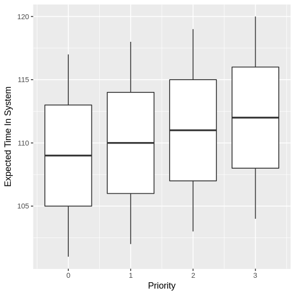

Assim, a partir da visualização da carga de trabalho, podemos analisar que o sistema sofre uma sobrecarga de processos a partir do tempo 20, que corresponde a submissão do último processo, até a finalização do primeiro processo a cumprir seu tempo de execução tempo este que pode variar, mas no mínimo é de 101, visto que todos os processos tem tempo de execução de 100.

### Aplicação da política

As políticas cumpriram o esperado, conforme podemos ver nos gráficos abaixo que expressam o tempo de execução de cada processo submetido ao sistema no eixo X e o correspondente Id no eixo Y:

Round Robin             |  Priority Updating
:-------------------------:|:-------------------------:
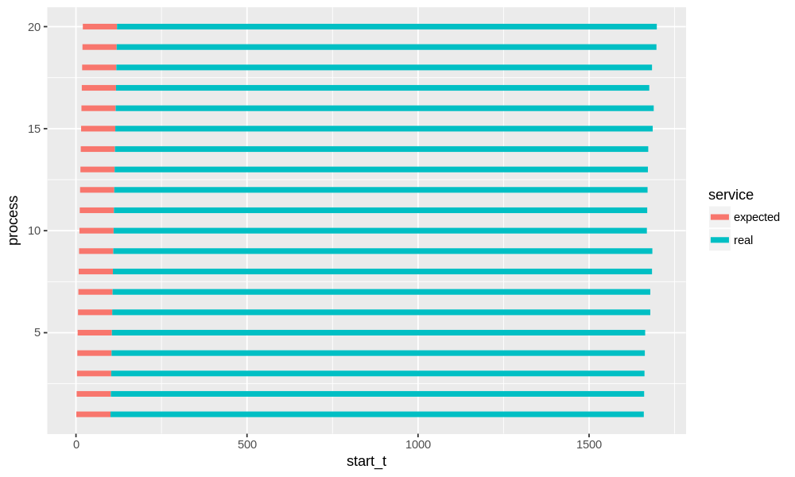 | 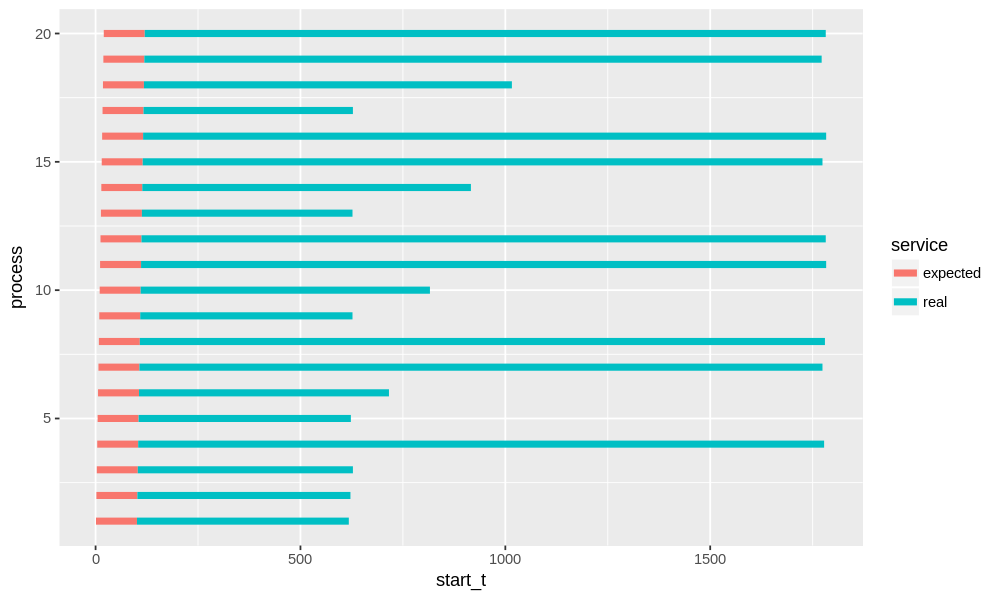

Priority Random             |  Xv6 Priority Random
:-------------------------:|:-------------------------:
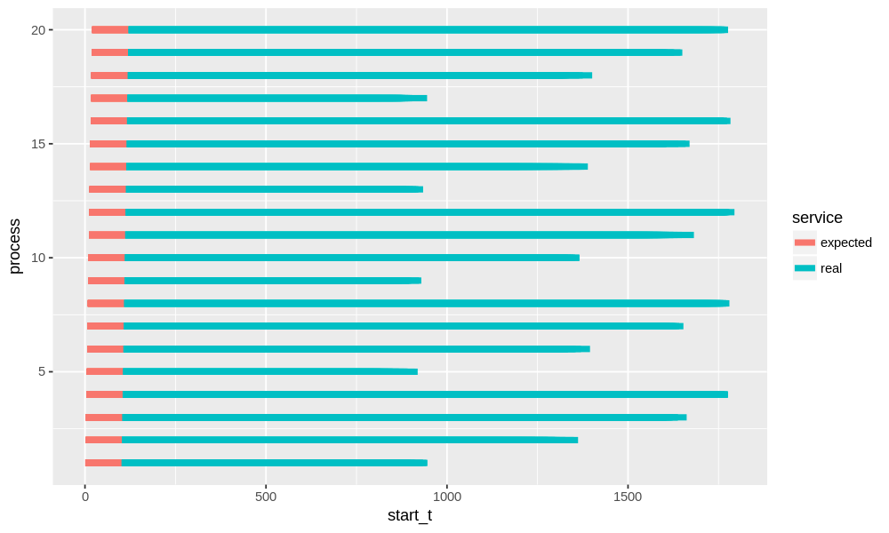 | 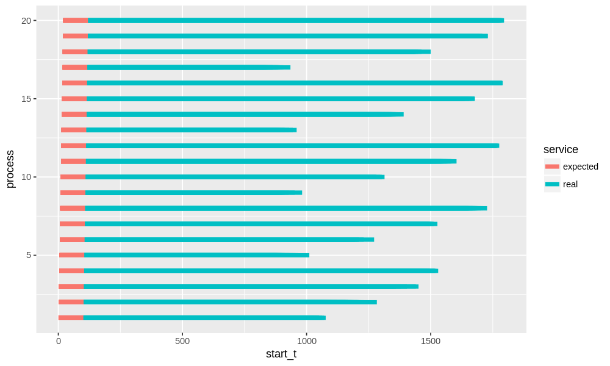

Assim, considerando que a prioridade dos processos faz um ciclo a cada 4 processos, temos que o priority updating realizar uma grande priorização, visto a distância dos valores escolhidos ao atribuir as prioridades, enquanto as políticas baseadas em sorteio tendem a distribuir melhor o tempo baseado no percentual de chance de cada prioridade.

Diante dos resultados, podemos afirmar que as políticas cumprem suas finalidades, conforme a expectativa.

### Justiça

O grau de justiça dos algoritmos foi avaliado considerando a variação de duas variáveis:

- *tempo extra de execução*: representa a diferente entre o tempo que o processo deveria ficar no sistema, e o tempo que o processo realmente ficou no sistema;
- *tempo de resposta*: representa a demora de tempo que o processo teve para ocupar a CPU pela primeira vez. 

#### Tempo Extra de Execução

Foi realizado o boxplot para verificar o grau de variância dos valores correspondentes a diferença entre o tempo que o processo deveria ficar no sistema, e o tempo que ele efetivamente ficou.

Assim, o tamanho da caixa implica o grau de variação dos valores de tempo de execução adicional ao tempo definido na submissão, e quanto menor for maior o grau de justiça.

O plot separa as caixas de acordo com as quatro classes de prioridade existentes, vejamos:

Round Robin             |  Priority Updating
:-------------------------:|:-------------------------:
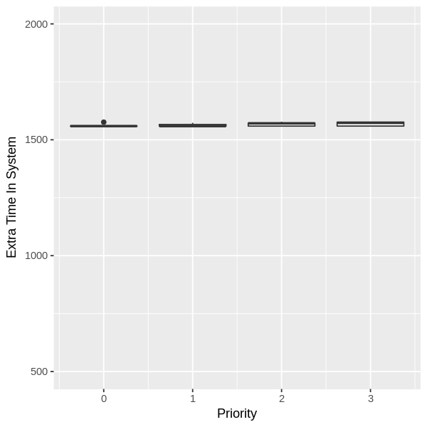 | 

Priority Random             |  Xv6 Priority Random
:-------------------------:|:-------------------------:
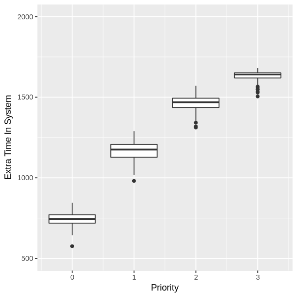 | 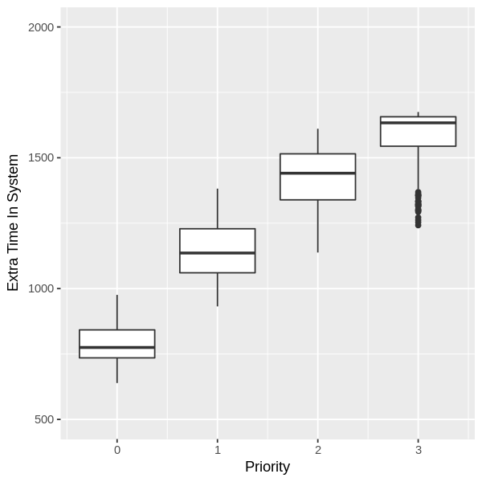

A partir dos gráficos, podemos avaliar que das quatro políticas analisadas cumpriram com seu requisito de justiça, bastando observar que no **Round Robin** as quatro caixas tem valores muito próximos e nos demais existe uma diferença de patamar conforme se varia a prioridade.

Por outro lado, foi verificada uma diferença no grau de justiça dos algoritmos, que podem ser ordenados da seguinte forma: Round Robin > Priority Updating > Priority Random > Xv6 Priority Random.

Tal diferença é decorrente do grau de variação da escolha do processo a ser executado: 

- **Round Robin**: que tem um comportamento sempre constante, tem menor grau de variância;
- **Priority Updating**: realiza modificações no valor das prioridades ao longo da execução, o que geral algum grau de varialibilidade;
- **Priority Random** e **Xv6 Priority Random**: tem um alto nível de modificação, mas o *primeiro* é mais eficaz em razão da característica do *segundo* de realizar mais de um sorteio no mesmo escalonamento sem verificar todos os processos contidos na lista.

#### Tempo de resposta

Utilizou-se de boxplot para observar o grau de variância dos valores correspondentes ao tempo de resposta dos processos, conforme os gráficos abaixo:

Round Robin             |  Priority Updating
:-------------------------:|:-------------------------:
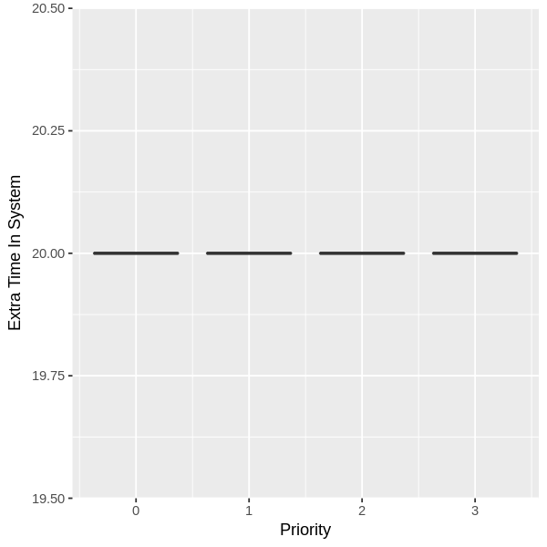 | 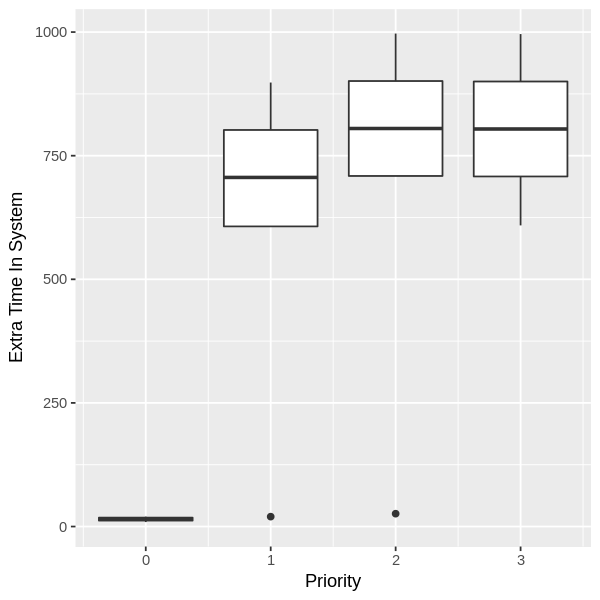

Priority Random             |  Xv6 Priority Random
:-------------------------:|:-------------------------:
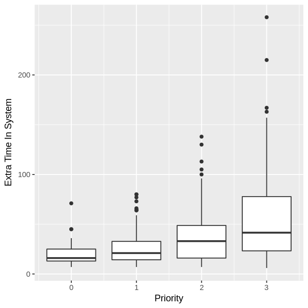 | 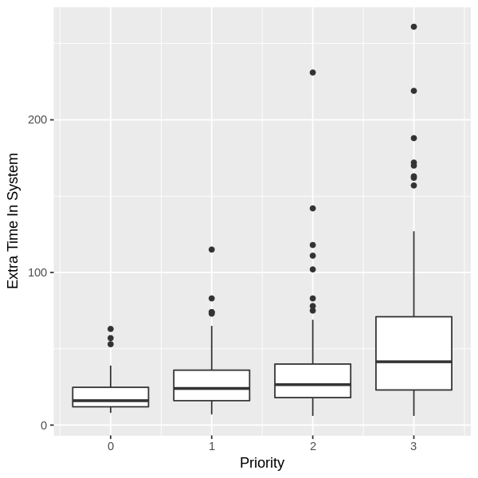

Os resultados demonstram fatos interessantes sobre as políticas, o **Roud Robin** conforme esperado não faz distinção de prioridade, por consequência o tempo de resposta de todas os processos é igual.

As políticas que consideram prioridade tiveram uma alta variância nos valores, especialmente a **Priority Updating**, onde os processos com prioridade diferente de 0 tiveram um tempo de espera superior a 500, o que não acontece com as demais.

Assim, diante da grande diferença de valores entre as prioridades, podemos fazer uma análise da variação dos valores na prioridade 0, considerando as 4 políticas, através do boxplot abaixo:

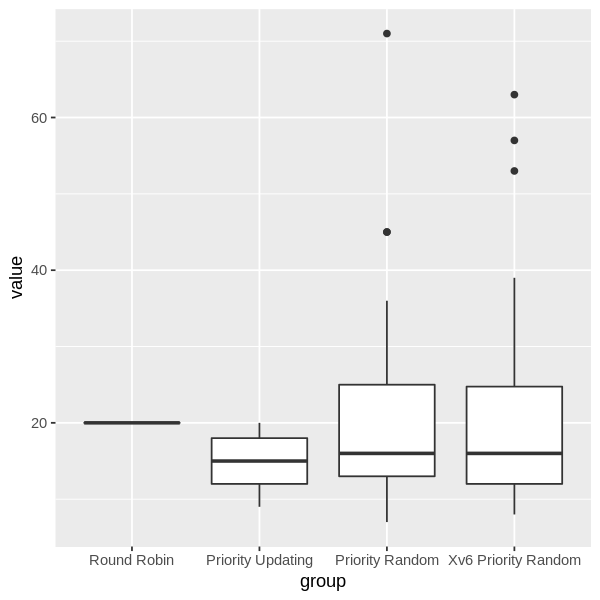

Ante o gráfico, fica fácil perceber que o **Round Robin** não está sujeito a variação do valor de espera, enquanto as demais políticas tem um menor grau de justiça.

Importante observar que a política **Priority Updating** tem tempo de espera sempre menor que o **Round Robin**, fato este que não é verdade para as demais políticas de priorização que inclusivem contém valores isolados da caixa(*outliers*).

## Conclusões

Diante dos resultados, podemos aduzir que as políticas de prioridade atingem com sucesso sua finalidade.

Contudo, cada abordagem de priorização tem suas peculiaridades que podem ser interessantes a depender do workload a ser submetido e da finalidade desejada. Por exemplo: o tempo de resposta do algoritmo **Priority Updating** garante um menor valor nos processos de maior prioridade, que é igual a 20 no pior caso, e sacrifica muito os demais, com valor maior que 500 no melhor caso; por outro lado, os demais algoritmos de prioridade, reduzem em menor proporção e com maior variância, mas o fazem para todas as prioridades, mantendo o tempo médio de espera para prioridade menor do que 20, e menor do que 50 o de maior prioridade.